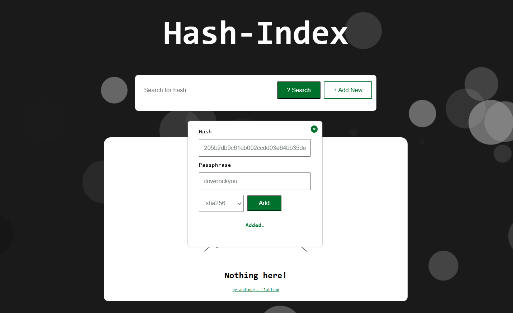
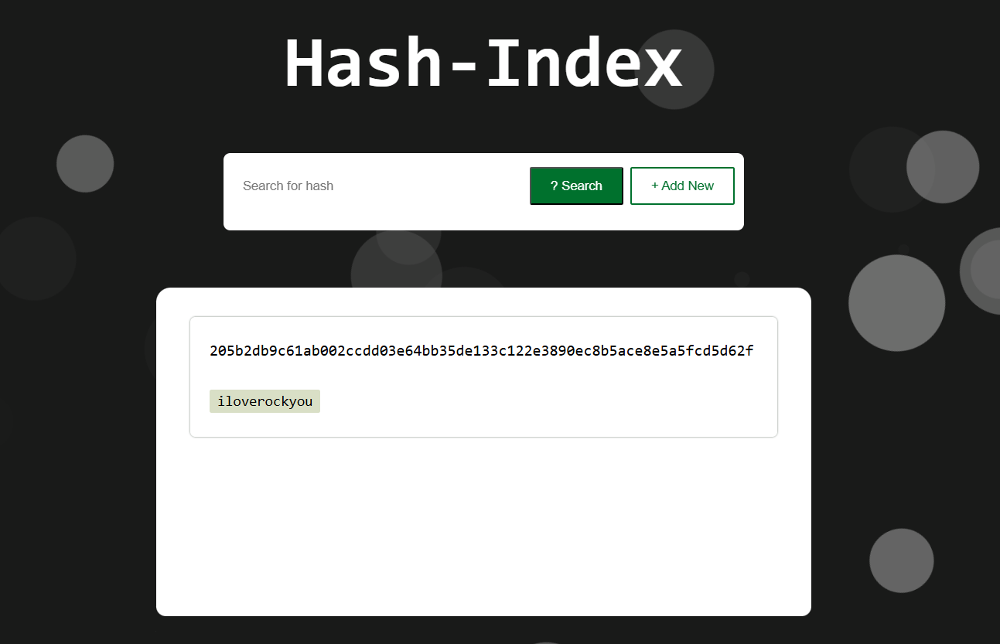

# hashindex
A python script and desktop website for indexing and querying password hashes. 

## Gallery




## General Usage
**Console App:**
```
python3 hindex.py console [-get <hash> | -add -hash <hash> -v <passphrase>]
```
**Options:**
- **`-get`:** Look up a hash's passphrase.
- **`-add`:** Index a new hash-passphrase pair.
- **`-htype`:** Hashing algorith used for the new entry.
- **`-hash`:** New hash to index.
- **`-v`:** New hash's plaintext value.

## Usage Examples
**Runing the web app:**
```
python3 hindex.py web
```
**Runing the console app:**
```
python3 hindex.py console -get '008c70392e3abfbd0fa47bbc2ed96aa99bd49e159727fcba0f2e6abeb3a9d601'
```
```
python3 hindex.py console -add -htype 'sha256' -hash '008c70392e3abfbd0fa47bbc2ed96aa99bd49e159727fcba0f2e6abeb3a9d601' -v 'Password123'
```

